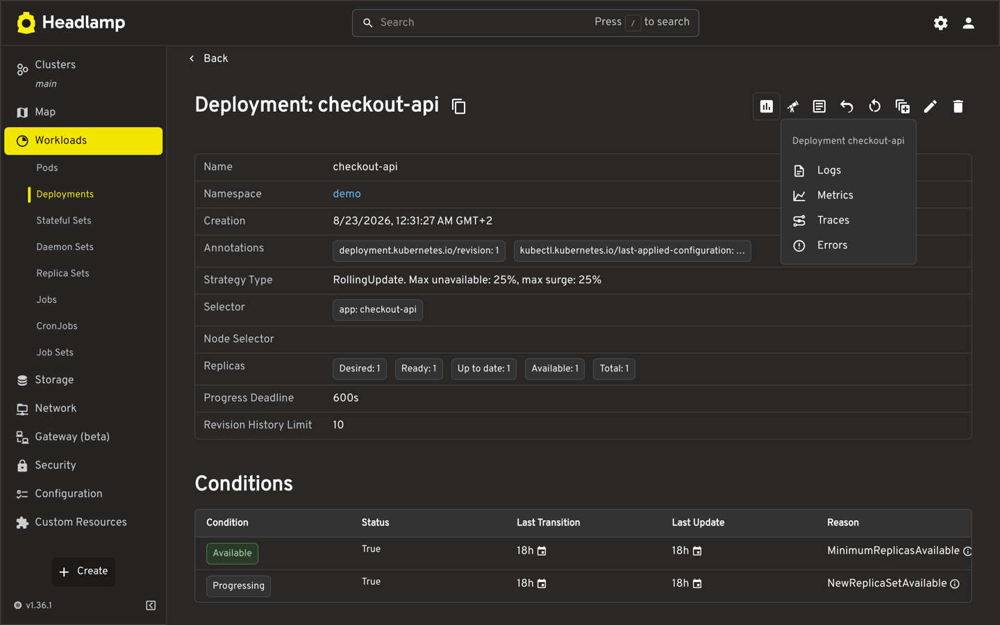
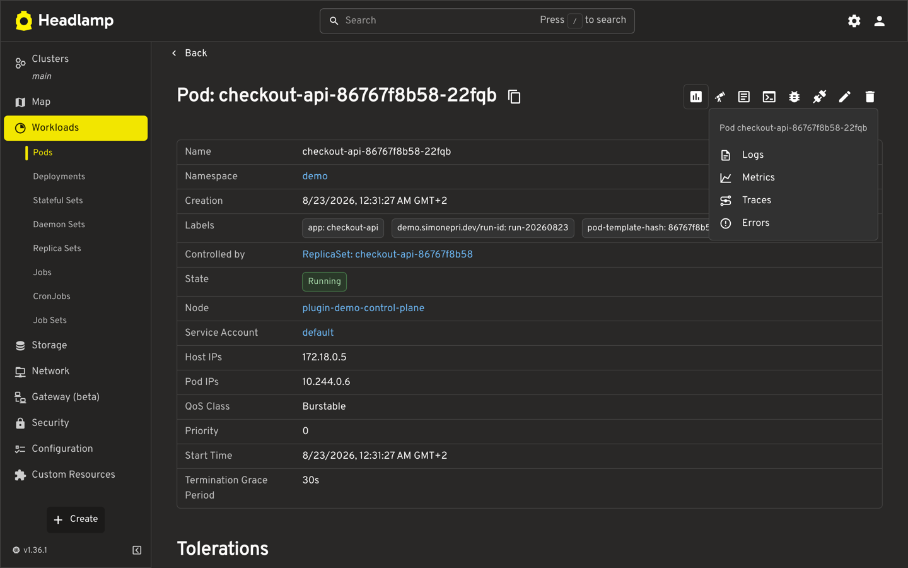
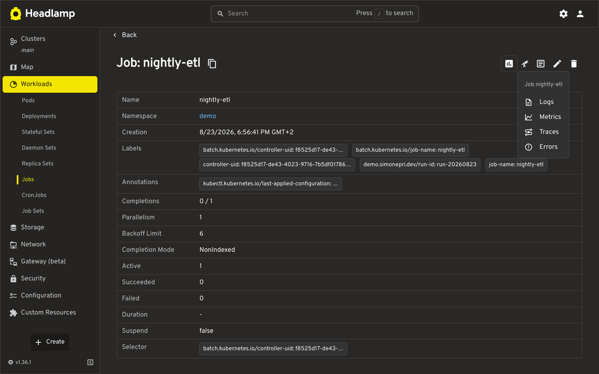
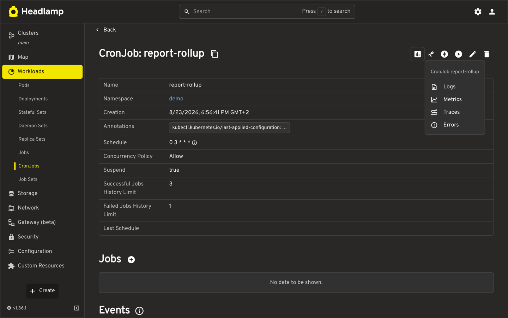
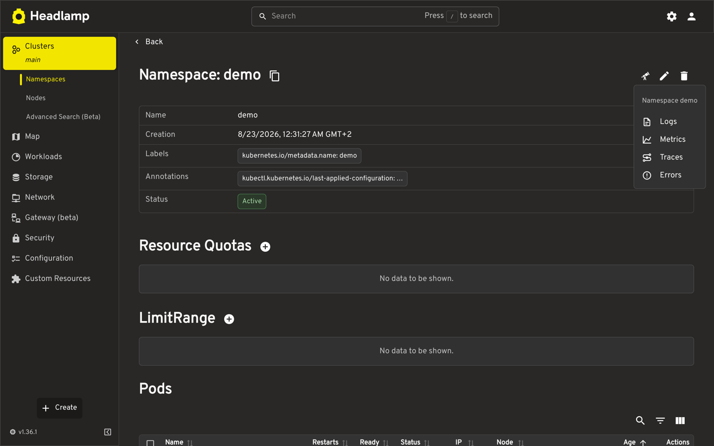
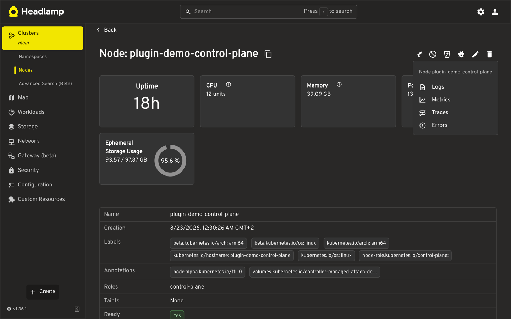

# SigNoz links for Headlamp

Adds Logs, Metrics, Traces, and Errors links to Kubernetes resource views in
[Headlamp](https://headlamp.dev). Links open [SigNoz](https://signoz.io) in a
new tab, where you authenticate as usual. The plugin has no API client, no
proxy, and no credentials. It only reads the resource Headlamp already
fetched.



## Where links appear

Pods, workloads (Deployment, StatefulSet, DaemonSet, ReplicaSet, Job,
CronJob), Namespaces, and Nodes. Other kinds render nothing.

Each view queries its own scope: a workload covers all its pods, a Pod covers
itself, a Namespace covers everything in it, and a Node filters on
`k8s.node.name`. Errors is the traces explorer narrowed to error spans.

<details>
<summary>Pod, Job, CronJob, Namespace, and Node views</summary>







</details>

## Configuration

The release archive carries no environment settings. Serve `config.json` next
to the extracted plugin, at
`static-plugins/signoz-observability-links/config.json`:

```json
{
  "schemaVersion": 1,
  "signozBaseUrl": "https://signoz.example.com",
  "allowedOrigins": ["https://signoz.example.com"],
  "windowMinutes": 30,
  "correlation": {
    "runLabelKeys": ["example.com/run-id"],
    "runAttribute": "example.run.id",
    "containerLabelKeys": ["example.com/container"],
    "containerAttribute": "k8s.container.name"
  }
}
```

Every field is required.

| Field | Rules |
| --- | --- |
| `schemaVersion` | Must be `1`. |
| `signozBaseUrl` | HTTPS, or HTTP on `localhost`, `127.0.0.1`, or `[::1]`. No credentials, query, or fragment. |
| `allowedOrigins` | 1 to 16 bare origins. Must include the origin of `signozBaseUrl`. |
| `windowMinutes` | Integer from 5 to 360. |
| `correlation.runLabelKeys`, `correlation.containerLabelKeys` | Kubernetes label keys read off the resource. 1 to 16 each. |
| `correlation.runAttribute`, `correlation.containerAttribute` | Attribute names to query in SigNoz. |

The two `correlation` groups sit on opposite sides of the lookup. `*LabelKeys`
names Kubernetes labels the plugin reads from the resource. `*Attribute` names
the SigNoz attribute that value is matched against.

Resource identity itself is not configurable. Queries use the standard
OpenTelemetry Kubernetes attributes, so your collector must set them:
`k8s.cluster.name`, `k8s.namespace.name`, `k8s.pod.name`, `k8s.node.name`, and
one of `k8s.deployment.name`, `k8s.statefulset.name`, `k8s.daemonset.name`,
`k8s.replicaset.name`, `k8s.job.name`, `k8s.cronjob.name`.

Nothing renders when the config is missing or invalid. It must be under 16 KiB
and is fetched once per page load, so reload Headlamp after changing it.

## Install

In-cluster, add an init container to your Headlamp Helm values that downloads
the release archive, checks it against the checksum published with the release,
and unpacks it into the shared plugins directory. Serve `config.json` beside
it, usually from a ConfigMap. `examples/headlamp-values.yaml` shows the layout,
mounting a locally built plugin instead of a download.

Without a `config.json`, the plugin falls back to whatever you enter under
Settings, which suits desktop Headlamp. A deployed `config.json` always wins,
so an admin keeps control of the allowlist for everyone.

On desktop, use the Plugin Catalog or
`pluginctl install <artifacthub-url>`. Both read from Artifact Hub.
`artifacthub-pkg.yml` holds that listing, though it only resolves once the
repository is registered on Artifact Hub and a release exists.

## Development

```console
pnpm install
pnpm tsc
pnpm lint
pnpm test
pnpm build
```

`examples/demo.sh` runs the plugin in a [kind](https://kind.sigs.k8s.io) cluster.
SigNoz does not need to be running, since links are built from the config and
the resource alone. The screenshots in `demo/` come from that cluster.

## Release

`release-please` proposes a release pull request from conventional commits.
Merging it publishes a GitHub release, and CI attaches the archive plus
`SHA256SUMS`, then records the URL and checksum in `artifacthub-pkg.yml`.
`pnpm release:archive` builds the same bytes locally: ownership, order, and
timestamps are fixed so the digest is reproducible.

## License

[MIT](LICENSE)
